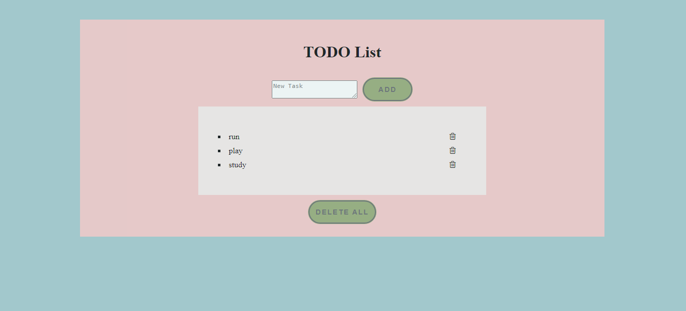
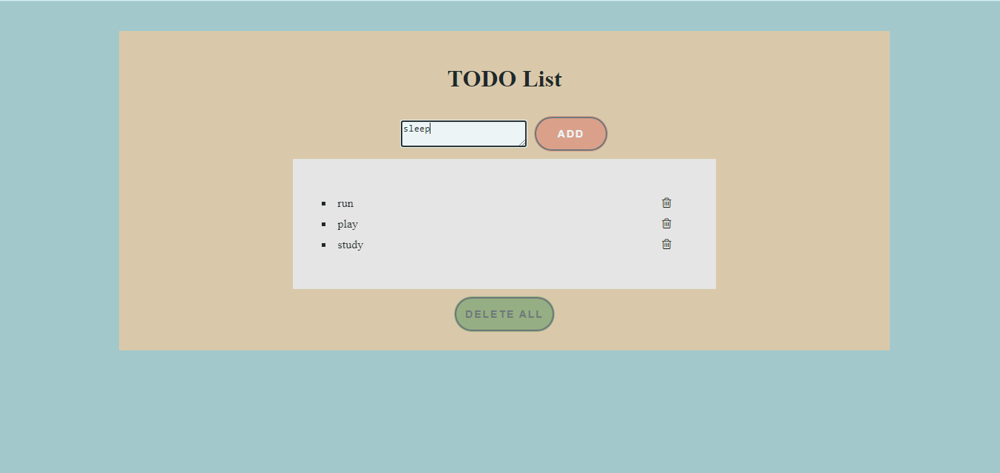

# TODO List
<h4> Proyecto sobre una TODO List web con persistencia de datos </h4>

## Descripción

 Consiste en una página web cuya función es la de una lista TODO, donde pueden agregarse tareas (o tasks) y eliminarse, ya sea de forma individual o todo el conjunto a la vez. 

 La persistencia se maneja con LocalStorage y a provechando el potencial de .innerHTML para guardar y recrear la lista cada vez que sea necesario. 

 El diseño es sencillo, ya que el foco esta puesto en lo funcional y lógica detrás. 

